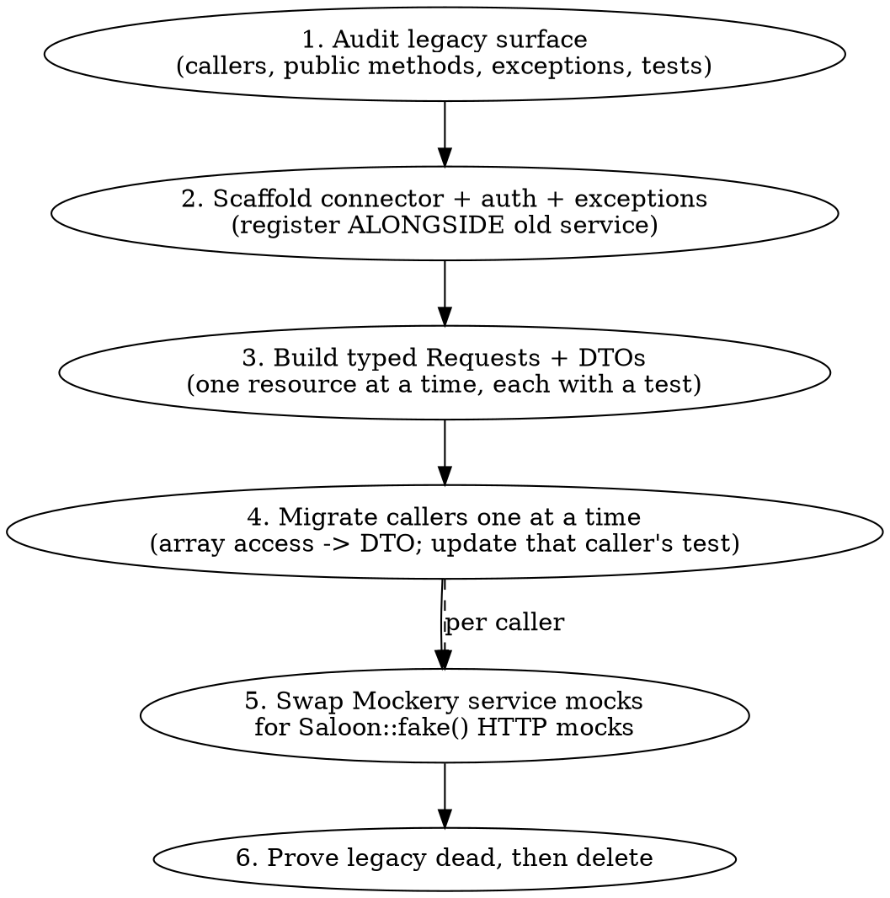

# Migrating an API to Saloon

## Overview

This codebase migrates third-party API integrations from `app/Services/{Api}/` (monolithic service classes) to `app/Http/Integrations/{Api}/` (Saloon connectors with typed requests + DTOs). The **Blizzard integration** is the completed reference: it replaced a 428-line `BlizzardService` with a `BlizzardConnector`, ~30 typed request classes, `spatie/laravel-data` DTOs, a typed exception hierarchy, and Saloon HTTP test fakes.

**Core principle: migrate in phases that keep the app green the whole way.** Stand up the new integration *alongside* the old service, cut callers over one at a time, then delete the legacy service only once it is provably dead. Never do a big-bang swap.

This is the codebase house pattern. For generic Saloon API syntax, see the `saloon-development` skill; for test mechanics, the `writing-tests` skill. This skill is about the **migration sequence and the conventions specific to this repo**.

## When to Use

- A legacy `app/Services/{Api}/{Api}Service.php` wraps `Http::`/Guzzle, returns associative arrays, throws `RequestException` or similar, and is injected into controllers/jobs/seeders.
- Tests mock that service with `Mockery::mock(...)` + `$this->app->instance(...)`.
- You're asked to "move X to Saloon", "refactor the X integration", or add Saloon to an API that currently has a hand-rolled client.

**Not for:** adding a single new request to an *already-Saloon* integration (just follow the existing request classes), or building a brand-new integration with no legacy to migrate (skip the bridge/caller phases, keep the structure).

## The Migration Sequence

Do the phases in this order. Each phase ends with the app fully working and tests green.



**Why this order:** the connector must exist and authenticate before any request works; requests must return typed DTOs before callers can consume them; callers must be migrated before their tests change; the legacy service can only be deleted once nothing references it. Skipping ahead (e.g. deleting the service early, or rewriting all tests up front) breaks the app mid-migration.

## Phase 1 — Audit the legacy surface

Before writing anything, list:
- **Public methods** of the legacy service callers actually use (e.g. `getCharacterStatus($name)`), and what shape they return (array keys → future DTO properties).
- **Callers**: every controller, job, seeder, cast, factory that injects the service. `grep` for the class name.
- **Exceptions** callers `catch`. These must keep working — the new typed exceptions implement a shared marker interface so existing `catch` blocks survive (see Phase 2).
- **Tests** that mock the service.

Capture this so each later phase has a checklist. **Do not** assume every value object moves: VOs persisted as Eloquent casts (e.g. `app/Casts/AsExpansion.php`) are model-layer types, not API concerns — leave them, or treat as a separate follow-up, and flag it to the user.

## Phase 2 — Scaffold the connector, auth, and exceptions

Create `app/Http/Integrations/{Api}/` mirroring Blizzard:

```
app/Http/Integrations/{Api}/
  {Api}Connector.php          # extends Saloon\Http\Connector
  Region.php / GameVersion.php # enums for host/namespace variants (if the API has them)
  Requests/{Resource}/...      # one Request class per endpoint
  Responses/...                # custom Response classes only when needed (see Phase 3)
  Data/{Resource}/...          # spatie/laravel-data DTOs
  Exceptions/...               # typed hierarchy + marker interface
  Concerns/HasCaching.php      # Cacheable plumbing (copy from Blizzard)
```

**Connector** (`app/Http/Integrations/Blizzard/BlizzardConnector.php` is the template):
- Constructor takes config as **promoted properties** (clientId, secret, region/host enum, defaults) — injected by the service provider, never read via `config()` inside the connector.
- `resolveBaseUrl()` returns the host (often region/version-derived).
- Traits: `AcceptsJson`, `AlwaysThrowOnErrors`, plus `HasRateLimits` and OAuth grant traits as needed.
- `getRequestException(Response, ?Throwable)` translates upstream errors into the typed hierarchy.

**OAuth (if the API uses client-credentials):** copy Blizzard's pattern exactly — `ClientCredentialsBasicAuthGrant` trait, `defaultOauthConfig()` with `setAllowBaseUrlOverride(true)->setTokenEndpoint(...)` (the token host usually differs from the API host), and a `boot()` that skips authentication when the pending request **is** the token request (else infinite loop), caching the token in `Cache::tags(['{api}', 'api-auth'])`.

**Exceptions** — the bridge that keeps callers' `catch` blocks working:
- A marker interface `{Api}RequestException extends Throwable` (see `Exceptions/BlizzardRequestException.php`) with accessors like `getMethod()/getEndpoint()/getBlizzardStatus()/getBlizzardCode()/getBlizzardBody()`.
- A generic `ApiException extends Saloon\Exceptions\Request\ClientException implements {Api}RequestException` as the fallback.
- Resource-specific subclasses (`CharacterNotFoundException`, etc.) extending the relevant Saloon status exception (e.g. `Statuses\NotFoundException`) and implementing the same interface.
- During the phased cutover it is normal and correct for the connector to throw **new** typed exceptions while callers still `catch` the **legacy** interface — make the new exceptions implement an interface the old `catch` accepts, or update the `catch` when you migrate that caller. Don't agonise over it; bridge via the interface.

**Register the connector as a singleton in the API's service provider, alongside the still-live legacy bindings:**

```php
// app/Providers/{Api}ServiceProvider.php — register()
$this->app->singleton({Api}Connector::class, function (Application $app) {
    $config = config('services.{api}');
    return new {Api}Connector(
        clientId: data_get($config, 'client_id'),
        clientSecret: data_get($config, 'client_secret'),
        // ...region/version enums via Region::from(...), GameVersion::fromName(...)
    );
});
```

Optionally add a facade (`app/Facades/Blizzard.php` returns `BlizzardConnector::class`) so callers can write `Blizzard::send($request)`.

At the end of this phase: connector authenticates, exceptions exist, **no caller has changed**, app is green.

## Phase 3 — Build typed Requests + DTOs

One Request class per endpoint. Template: `Requests/Item/GetItemRequest.php`.

```php
class GetItemRequest extends Request implements Cacheable
{
    use HasCaching;

    protected Method $method = Method::GET;

    public function __construct(protected int $itemId) {}

    public function resolveEndpoint(): string
    {
        return "/data/wow/item/{$this->itemId}";
    }

    public function boot(PendingRequest $pendingRequest): void
    {
        /** @var BlizzardConnector $connector */
        $connector = $pendingRequest->getConnector();
        $pendingRequest->headers()->add('Battlenet-Namespace', $connector->namespace('static'));
    }

    public function cacheExpiryInSeconds(): int { return 2628000; }

    public function createDtoFromResponse(Response $response): ItemData
    {
        return ItemData::from($response->json());
    }
}
```

**DTOs use `spatie/laravel-data`**, not plain classes — `extends Spatie\LaravelData\Data`, `#[MapInputName(SnakeCaseMapper::class)]` for the API's snake_case JSON, `readonly` promoted properties, `Optional|type` for fields that may be absent. Template: `Data/Item/ItemData.php`.

**Custom Response class only when you need behaviour on the response** — e.g. memoising the DTO so middleware-enriched state survives repeated `dto()` calls (`Responses/GetMediaResponse.php` returns `$this->mediaData ??= MediaData::from($this->json())`). Most requests need no custom Response; returning the DTO via `createDtoFromResponse` is enough.

Each request lands **with a test** (Phase 5 patterns). Build resource by resource; callers still use the legacy service until Phase 4.

## Phase 4 — Migrate callers one at a time

Replace the injected service with the connector, send requests, consume **DTO properties instead of array keys**:

```php
// Before (legacy service, array access)
$status = $blizzard->getCharacterStatus($name);
$characterId = $status['id'];

// After (Saloon request, DTO access)
$status = $blizzard->send(new GetCharacterStatusRequest($blizzard->defaultRealmSlug(), $name))->dto();
$characterId = $status->id;
```

In callers, `$connector->send(new SomeRequest(...))->dto()` is the norm; `->json()` when you genuinely want the raw array. After each caller, update **that caller's test** and run just it (`vendor/bin/sail artisan test --compact --filter=...`). Do controllers/jobs first (well-isolated), leave casts/seeders that touch persisted VOs for last pending the Phase 1 decision.

## Phase 5 — Swap Mockery service mocks for Saloon fakes

This is where the biggest, most error-prone change happens. Replace service-layer Mockery with HTTP-layer Saloon fakes (`Saloon::fake()` is the Laravel-plugin alias of `MockClient::global()`). Key the fake by **request class** (preferred) or URL wildcard.

**⚠️ The #1 gotcha: every fake that sends an authenticated request MUST mock the OAuth token request first.** Without it the connector's `boot()` tries to fetch a real token, the whole request chain fails silently, and your data never gets written. Symptom: empty tables / "unable to guess a mock response" for the token endpoint.

```php
use Saloon\Laravel\Facades\Saloon;
use Saloon\Http\Faking\MockResponse;
use Saloon\Http\OAuth2\GetClientCredentialsTokenBasicAuthRequest;

Saloon::fake([
    // ALWAYS include the token mock for authenticated APIs:
    GetClientCredentialsTokenBasicAuthRequest::class => MockResponse::make([
        'access_token' => 'test_token', 'token_type' => 'bearer', 'expires_in' => 3600,
    ]),
    // (URL form also works: 'eu.battle.net/oauth/token' => ...)

    GetCharacterProfileRequest::class => MockResponse::make($this->makeProfileResponse(), 200),
]);
```

**Dynamic responses** — when one request class is hit with different ids, use a callable that extracts the id from the URL:

```php
GetItemRequest::class => function (PendingRequest $request): MockResponse {
    $id = (int) last(explode('/', parse_url($request->getUrl(), PHP_URL_PATH)));
    if ($id === 28453) {
        return MockResponse::make(['code' => 404, 'type' => 'BLZWEBAPI00000404'], 404);
    }
    return MockResponse::make($this->makeItemResponse($id), 200);
},
```

**Assertions:** `Saloon::assertSent(GetItemRequest::class)`, `Saloon::assertSentCount(2)`, `Saloon::assertNothingSent()` (great for "skipped because already populated" paths).

**⚠️ Asserting on auth / boot-applied headers: read the `PendingRequest`, not the `Request`.** The `assertSent` closure is called as `$closure($request, $response)` where `$request` is the **base `Request`** (`MockClient::checkClosureAgainstResponses`). Authentication (`defaultAuth()`) and anything added in a request's `boot()` are applied during the send pipeline to the **`PendingRequest`** and never propagate back to the base `Request`. So `$request->headers()->get('Authorization')` is always `null`. To assert on what was actually sent, reach the sent `PendingRequest` through the `Response`:

```php
Saloon::assertSent(function (Request $request, Response $response) {
    // ❌ $request->headers()->get('Authorization') is null — auth isn't on the base Request
    return $response->getPendingRequest()->headers()->get('Authorization') === 'test-token';
});
```

`$request->body()`, `$request->resolveEndpoint()`, and `$request instanceof X` *are* fine on the base `Request` — this only bites for state the pipeline adds (auth headers, `boot()` headers/query).

**Test the connector's exception translation** by faking a Blizzard-shaped error body + status and asserting the typed exception (`tests/Unit/Http/Integrations/Blizzard/BlizzardConnectorTest.php`):

```php
Saloon::fake([
    'eu.battle.net/oauth/token' => $this->tokenMock(),
    'eu.api.blizzard.com/profile/wow/character/*' =>
        MockResponse::make(['type' => 'BLZWEBAPI00000404', 'detail' => 'Not found'], 404),
]);
$this->expectException(CharacterNotFoundException::class);
$this->makeConnector()->send(/* ... */);
```

Provide a base test case (`BlizzardTestCase`) with `makeConnector()` and `tokenMock()` helpers so every integration test shares them. Per project rules, convert/repoint legacy tests — don't delete test files without approval.

## Phase 6 — Prove dead, then delete

Only after every caller and test is migrated and green:
- `grep` the legacy service + value objects across `app/` and `tests/`. They should appear **only** in their own now-orphaned tests, if at all.
- Remove the legacy bindings from the service provider's `register()` and `provides()`.
- Delete the legacy classes (keeping any VOs that intentionally stayed per Phase 1).
- Run `vendor/bin/sail bin pint --dirty --format agent`, then the API's test subset, then ask before running the full suite.

## Quick Reference

| Legacy thing | Saloon replacement | Reference file |
|---|---|---|
| `app/Services/{Api}/{Api}Service.php` | `app/Http/Integrations/{Api}/{Api}Connector.php` | `BlizzardConnector.php` |
| Service method `getThing($id)` | `Requests/{Resource}/GetThingRequest.php` | `Requests/Item/GetItemRequest.php` |
| Array return `$x['id']` | `spatie/laravel-data` DTO `$x->id` | `Data/Item/ItemData.php` |
| Generic `RequestException` | Typed hierarchy + marker interface | `Exceptions/*.php`, `BlizzardRequestException.php` |
| `Cache::remember(...)` in service | `implements Cacheable` + `HasCaching` + `cacheExpiryInSeconds()` | `Concerns/HasCaching.php` |
| Manual token fetch | OAuth grant trait + cached `boot()` | `BlizzardConnector::boot()` |
| `Mockery::mock(Service::class)` | `Saloon::fake([Request::class => MockResponse::make(...)])` | `ItemSeederTest.php` |
| (none) | **OAuth token mock in every authed fake** | `ProcessGrmUploadTest.php` |

## Pagination

Any endpoint that returns paginated results gets a dedicated paginator class in `Pagination/` — never an inline anonymous class on the connector. The **Blizzard** and **RaidHelper** integrations show two valid patterns.

### Directory convention

```
app/Http/Integrations/{Api}/
  Pagination/
    EventsPaginator.php       # extends PagedPaginator (header-based, RaidHelper)
    SearchPaginator.php       # extends Paginator (query-param, Blizzard)
```

### Two instantiation patterns

**Pattern A — request owns the paginator** (`HasRequestPagination`, Blizzard)

Use when a single request class is always paginated and the paginator is tightly coupled to it:

```php
// Request
class SearchItemsRequest extends Request implements Cacheable, HasRequestPagination, Paginatable
{
    public function paginate(Connector $connector): Paginator
    {
        return new SearchPaginator(connector: $connector, request: $this);
    }
}

// Caller
$paginator = (new SearchItemsRequest(name: 'Item'))->paginate($connector);
foreach ($paginator->items() as $item) { ... }
```

**Pattern B — caller instantiates the paginator directly** (RaidHelper)

Use when the connector serves multiple request types and you want to pick the paginator at the call site:

```php
$paginator = new EventsPaginator(connector: $connector, request: new GetEventsRequest($channelId));
foreach ($paginator->items() as $event) { ... }
```

### Implementing a paginator class

Extend `PagedPaginator` for page-number–based APIs (header or query param). Mirror this structure:

```php
class EventsPaginator extends PagedPaginator
{
    protected function isLastPage(Response $response): bool
    {
        // Return true when there are no more pages.
        // RaidHelper: stop when eventsTransmitted < 1000 (threshold, not a page count field).
        return (int) $response->json('eventsTransmitted', 0) < 1000;
    }

    /** @return array<int, mixed> */
    protected function getPageItems(Response $response, Request $request): array
    {
        return $response->json('postedEvents', []);
    }

    protected function applyPagination(Request $request): Request
    {
        // Header-based: add a Page header. Query-param-based: merge into query().
        $request->headers()->add('Page', $this->currentPage);
        return $request;
    }
}
```

### The `Paginatable` interface requirement

**The request passed to any paginator constructor must implement `Saloon\PaginationPlugin\Contracts\Paginatable`.** Without it, `Paginator::__construct()` throws `InvalidArgumentException` at runtime. For Pattern A this is already on the request class. For Pattern B, the request class needs it too, even if it has no `paginate()` method of its own.

### Testing paginators

Create `tests/Unit/Http/Integrations/{Api}/Pagination/{Name}PaginatorTest.php`. Tests to cover:

- **Multi-page iteration** — fake N pages, assert all `eventsTransmitted`/`page` values appear when iterating with `foreach`
- **`items()` across pages** — `iterator_to_array($paginator->items(), false)` gives all items in order
- **Single-page termination** — a response that signals last page stops after one request
- **Pagination transport** — assert the `Page` header (or query param) carries the correct page number

Use `Saloon::fake([...])` with sequential `MockResponse::make()` entries (no key = consumed in order):

```php
Saloon::fake([
    MockResponse::make(['eventsTransmitted' => 1000, 'postedEvents' => [...]], 200),
    MockResponse::make(['eventsTransmitted' => 3,    'postedEvents' => [...]], 200),
]);
```

The test's stub request must implement `Paginatable`:

```php
class EventsProbeRequest extends Request implements Paginatable
{
    protected Method $method = Method::GET;
    public function resolveEndpoint(): string { return '/probe'; }
}
```

**⚠️ Header values from `applyPagination` are integers, not strings.** `$request->headers()->add('Page', $this->currentPage)` stores an `int`. When asserting, use loose equality (`==`) not strict (`===`):

```php
Saloon::assertSent(function (Request $request, Response $response) {
    $page = $response->getPendingRequest()->headers()->get('Page');
    return $page == '1' || $page == '2'; // == not ===
});
```

(The `PendingRequest` caveat still applies — see Phase 5 above. Pagination headers are set by `applyPagination` during the send pipeline, so they live on the `PendingRequest`, not the base `Request`.)

## Common Mistakes

| Mistake | Reality / Fix |
|---|---|
| Big-bang: delete service, rewrite everything at once | App breaks mid-flight. Migrate in phases; keep old + new side by side until callers are cut over. |
| Forgetting the OAuth token mock in tests | Whole request chain fails silently; tables stay empty. Always mock `GetClientCredentialsTokenBasicAuthRequest` (or the token URL) first. |
| Reading `config()` inside the connector | Inject config via constructor (promoted props) from the service provider. Connector is config-agnostic. |
| Plain DTO classes | Use `spatie/laravel-data` (`extends Data`, `MapInputName(SnakeCaseMapper)`). |
| Custom Response class for every request | Only when the response needs behaviour (e.g. DTO memoisation). Default: `createDtoFromResponse`. |
| Moving Eloquent-cast value objects into `Data/` | Cast VOs are model-layer; they may not map cleanly to `laravel-data`. Leave them or split into a follow-up; ask the user. |
| Deleting legacy tests to "clean up" | Don't delete test files without approval — convert/repoint them. |
| GraphQL/200-with-errors APIs | `AlwaysThrowOnErrors` only fires on HTTP failure status. Detect `{"errors":[...]}` at HTTP 200 in the response/DTO layer, not `getRequestException`. |
| Asserting auth header off the `assertSent` `Request` arg | It's the base `Request`; auth/`boot()` headers live on the sent `PendingRequest`. Read `$response->getPendingRequest()->headers()->get(...)` instead. |
| Inline anonymous paginator on the connector | Extract to `Pagination/{Name}Paginator.php`. Inline classes can't be tested and block adding a second paginator later. |
| Forgetting `Paginatable` on the request | Paginator constructor throws `InvalidArgumentException` at runtime. All requests passed to a paginator must implement `Paginatable`. |
| Strict `===` comparison on paginator header values | `applyPagination` stores `$this->currentPage` as an `int`; `headers()->get()` returns it as-is. Use `==` when asserting page header values in tests. |

## Red Flags — Stop

- About to delete `{Api}Service.php` before callers are migrated → stop, do Phase 4 first.
- Writing a test that sends an authed request with no token mock → add it.
- Connector calling `config(...)` → move config to the provider.
- Rewriting all tests before any caller changed → migrate caller + its test together, per caller.
