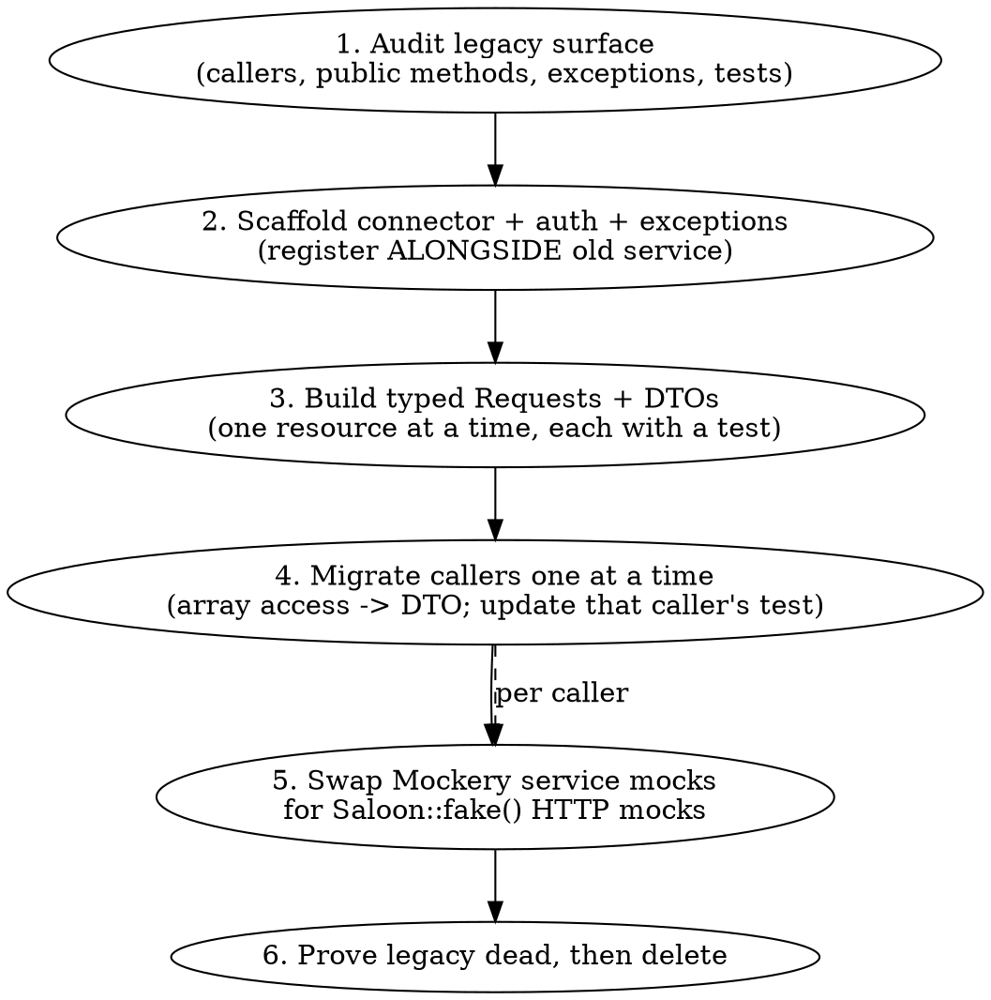

# Migrating an API to Saloon

## Overview

This codebase migrates third-party API integrations from `app/Services/{Api}/` (monolithic service classes) to `app/Http/Integrations/{Api}/` (Saloon connectors with typed requests + DTOs). The **Blizzard integration** is the completed reference: it replaced a 428-line `BlizzardService` with a `BlizzardConnector`, ~30 typed request classes, `spatie/laravel-data` DTOs, a typed exception hierarchy, and Saloon HTTP test fakes.

**Core principle: migrate in phases that keep the app green the whole way.** Stand up the new integration *alongside* the old service, cut callers over one at a time, then delete the legacy service only once it is provably dead. Never do a big-bang swap.

This is the codebase house pattern. This skill is about the **migration sequence and the conventions specific to this repo**. It does not repeat the general guidance — load these alongside it:

- **REQUIRED SUB-SKILL:** `saloon-development` — generic Saloon syntax. The project is on Saloon **v4** (confirm with `vendor/bin/sail composer show saloonphp/saloon`).
- **REQUIRED SUB-SKILL:** `spatie-laravel-php-standards` and `laravel-best-practices` (`rules/http-client.md`, `rules/error-handling.md`, `rules/caching.md`, `rules/architecture.md`).
- **REQUIRED SUB-SKILL:** `superpowers:test-driven-development` and `testing-best-practices` — every new class lands red → green.
- The "Third-Party API Service Classes" section of `CLAUDE.md`, plus the `.ai/rules` files `index.md` maps to your paths (`app.md`, `services.md`, `jobs.md`, `testing.md`, `testing-groups.md`).

## When to Use

- A legacy `app/Services/{Api}/{Api}Service.php` wraps `Http::`/Guzzle, returns associative arrays, throws `RequestException` or similar, and is injected into controllers/jobs/seeders.
- Tests mock that service with `Mockery::mock(...)` + `$this->app->instance(...)`.
- You're asked to "move X to Saloon", "refactor the X integration", or add Saloon to an API that currently has a hand-rolled client.

**Not for:** adding a single new request to an *already-Saloon* integration (just follow the existing request classes), or building a brand-new integration with no legacy to migrate (skip the bridge/caller phases, keep the structure).

## Reference files

The detail for each phase lives in a sibling file. **Before planning or implementing a phase, read every file listed for it.**

| Phase | Read before planning/implementing it |
|---|---|
| 1. Audit | (inline below) |
| 2. Connector, auth, exceptions | `connector.md` |
| 3. Requests + DTOs | `requests-and-dtos.md` **and** `testing-with-fakes.md` (request tests are written first) |
| 4. Callers | `testing-with-fakes.md` (each caller's test changes with it) |
| 5. Mockery → Saloon fakes | `testing-with-fakes.md` |
| 6. Delete legacy | (inline below) |
| Any paginated endpoint | `pagination.md` |

## The Migration Sequence

Do the phases in this order. Each phase ends with the app fully working and tests green.


```dot
digraph migration {
    rankdir=TB;
    audit       [label="1. Audit legacy surface\n(callers, public methods, exceptions, tests)"];
    scaffold    [label="2. Scaffold connector + auth + exceptions\n(register ALONGSIDE old service)"];
    requests    [label="3. Build typed Requests + DTOs\n(one resource at a time, each with a test)"];
    callers     [label="4. Migrate callers one at a time\n(array access -> DTO; update that caller's test)"];
    tests       [label="5. Swap Mockery service mocks\nfor Saloon::fake() HTTP mocks"];
    reap        [label="6. Prove legacy dead, then delete"];
    audit -> scaffold -> requests -> callers -> tests -> reap;
    callers -> tests [style=dashed,label="per caller"];
}
```

**Why this order:** the connector must exist and authenticate before any request works; requests must return typed DTOs before callers can consume them; callers must be migrated before their tests change; the legacy service can only be deleted once nothing references it. Skipping ahead (e.g. deleting the service early, or rewriting all tests up front) breaks the app mid-migration.

**Planning:** plan one phase per chunk, in order. When planning a phase, load its reference files from the table above first. Every plan task that touches Phases 2–5 names the reference file(s) its implementer must read, so a subagent executing that one task loads the right detail without the whole skill.

## Phase 1 — Audit the legacy surface

Before writing anything, list:
- **Public methods** of the legacy service callers actually use (e.g. `getCharacterStatus($name)`), and what shape they return (array keys → future DTO properties).
- **Callers**: every controller, job, seeder, cast, factory that injects the service. `grep` for the class name.
- **Transport behaviour**: every `timeout()`, `connectTimeout()`, `retry()` and cache TTL in the legacy client, and which methods are idempotent (`GET`) versus state-changing (`POST`/`PUT`/`PATCH`/`DELETE`). These carry over in Phase 2/3; see `connector.md` ("Timeouts and retries").
- **Implicit config**: values the legacy method read from `config()` without the caller passing them (a default guild id, realm or server id). These become explicit request constructor arguments, not connector defaults (the Blizzard connector's default realm/guild slugs were deliberately removed).
- **Exceptions** callers `catch`. These must keep working — the new typed exceptions implement a shared marker interface so existing `catch` blocks survive (see `connector.md`).
- **Paginated endpoints** — each needs a paginator class (`pagination.md`).
- **Tests** that mock the service.

Capture this so each later phase has a checklist. **Do not** assume every value object moves: VOs persisted as Eloquent casts (e.g. `app/Casts/AsExpansion.php`) are model-layer types, not API concerns — leave them, or treat as a separate follow-up, and flag it to the user.

## Phase 2 — Scaffold the connector, auth, and exceptions

**REQUIRED:** read `connector.md` first.

Checklist: directory skeleton → connector (config via constructor, timeouts) → OAuth or static-token auth → typed exception hierarchy + marker interface → singleton binding in the service provider **alongside** the legacy bindings. No facade.

**Exit:** connector authenticates, exceptions exist, **no caller has changed**, app is green.

## Phase 3 — Build typed Requests + DTOs

**REQUIRED:** read `requests-and-dtos.md` and `testing-with-fakes.md` first (plus `pagination.md` for paginated endpoints).

Checklist, per resource: failing request test → request class → failing DTO unit test → `laravel-data` DTO → green. One dedicated request per known resource type.

**Exit:** every request has its own test, every DTO has a unit test, callers still use the legacy service.

## Phase 4 — Migrate callers one at a time

Replace the injected service with the connector, send requests, consume **DTO properties instead of array keys**:

```php
// Before (legacy service, array access)
$status = $blizzard->getCharacterStatus($name);
$characterId = $status['id'];

// After (Saloon request, DTO access; realm passed explicitly, not defaulted on the connector)
$status = $blizzard->send(new GetCharacterStatusRequest($realmSlug, $name))->dto();
$characterId = $status->id;
```

In callers, `$connector->send(new SomeRequest(...))->dto()` is the norm. Use `->json()` only when you really want the raw array.

**How each caller gets the connector** (dependency injection, never a facade, never `resolve()`):

| Caller | Injection |
|---|---|
| Controller, command, notification, seeder, action | Constructor property promotion: `public function __construct(private BlizzardConnector $blizzard) {}` |
| Queued job | Method injection on `handle(BlizzardConnector $blizzard)`. Never the job constructor, because jobs are serialised. |
| Eloquent model / API resource / job `failed()` | `app(BlizzardConnector::class)`, only because injection is impossible. Call it out in a comment and resolve it **once** (into a property or a memoised value), not on every accessor call. |

When the caller writes API data to the database, sync with `Model::updateOrCreate()` keyed on the external id (use `firstOrNew()` only to diff before saving). Never `find()` then `save()`. Multi-write syncs go in a `DB::transaction(fn () => ...)` closure.

After each caller, update **that caller's test** using `testing-with-fakes.md` (red first if behaviour changes) and run just it: `vendor/bin/sail test --compact --display-phpunit-notices --filter=...`. Do controllers/jobs first because they are well isolated. Leave casts/seeders that touch persisted VOs for last, pending the Phase 1 decision.

## Phase 5 — Swap Mockery service mocks for Saloon fakes

**REQUIRED:** read `testing-with-fakes.md` first.

Checklist: list remaining tests that `Mockery::mock` the legacy service → convert each to `Saloon::fake()` keyed by request class (token mock first for OAuth APIs) → assert outcomes, never swallow errors → fix every PHPUnit notice. Convert/repoint tests; don't delete test files without approval.

**Exit:** no test mocks the legacy service; all integration tests fake at the HTTP layer and pass.

## Phase 6 — Prove dead, then delete

Only after every caller and test is migrated and green:
- `grep` the legacy service + value objects across `app/` and `tests/`. They should appear **only** in their own now-orphaned tests, if at all.
- Remove the legacy bindings from the service provider's `register()` and `provides()`.
- Delete the legacy classes (keeping any VOs that intentionally stayed per Phase 1).
- Run `vendor/bin/sail bin pint --dirty --format agent`, then the API's test subset (`vendor/bin/sail test --compact --display-phpunit-notices --group={api}-integration`), then ask before running the full suite (`vendor/bin/sail test --display-phpunit-notices`; never `--parallel` with `--compact`).
- Run `graphify update .` so the knowledge graph drops the deleted classes.
- Don't stage or commit. Leave the diff for the user to review.

## Quick Reference

| Legacy thing | Saloon replacement | Reference file | Details |
|---|---|---|---|
| `app/Services/{Api}/{Api}Service.php` | `app/Http/Integrations/{Api}/{Api}Connector.php` | `BlizzardConnector.php` | `connector.md` |
| Service method `getThing($id)` | `Requests/{Resource}/GetThingRequest.php` | `Requests/Item/GetItemRequest.php` | `requests-and-dtos.md` |
| Array return `$x['id']` | `spatie/laravel-data` DTO `$x->id` | `Data/Item/ItemData.php` | `requests-and-dtos.md` |
| Generic `RequestException` | Typed hierarchy + marker interface | `Exceptions/*.php`, `BlizzardRequestException.php` | `connector.md` |
| `Cache::remember(...)` in service | `implements Cacheable` + `HasCaching` + `cacheExpiryInSeconds()` | `Concerns/HasCaching.php` | `requests-and-dtos.md` |
| Manual token fetch | OAuth grant trait + cached `boot()` | `BlizzardConnector::boot()` | `connector.md` |
| Static bearer/raw token | `defaultAuth()` → `TokenAuthenticator` | `RaidHelperConnector.php` | `connector.md` |
| `Http::timeout(10)` | `HasTimeout` + `$connectTimeout`/`$requestTimeout` on connector | — | `connector.md` |
| `Http::retry(3, 200)` | `$tries`/`$retryInterval` on idempotent **request** classes only | — | `connector.md` |
| Paginated endpoint | `Pagination/{Name}Paginator.php` | `EventsPaginator.php` | `pagination.md` |
| Service injected / `Blizzard::` facade | Constructor DI; `handle()` DI in jobs; `app()` once in models | — | Phase 4 above |
| `Mockery::mock(Service::class)` | `Saloon::fake([Request::class => MockResponse::make(...)])` | `ItemSeederTest.php` | `testing-with-fakes.md` |
| (none) | **OAuth token mock in every authed fake** | `ProcessGrmUploadTest.php` | `testing-with-fakes.md` |

## Common Mistakes

Phase-specific mistakes are listed at the end of each reference file. These cut across phases:

| Mistake | Reality / Fix |
|---|---|
| Big-bang: delete service, rewrite everything at once | App breaks mid-flight. Migrate in phases; keep old + new side by side until callers are cut over. |
| Planning or implementing a phase without its reference file | Load the file(s) from the Reference files table first; the gotchas live there. |
| Adding a facade, or `Blizzard::send()` in new code | Inject the connector. Facades are legacy; `app()` only where injection is impossible, resolved once. |
| Connector in a queued job's constructor | Inject it into `handle()`. Job constructors are serialised. |
| Moving Eloquent-cast value objects into `Data/` | Cast VOs are model-layer; they may not map cleanly to `laravel-data`. Leave them or split into a follow-up; ask the user. |
| `vendor/bin/sail artisan test` / raw `phpunit` | `vendor/bin/sail test --compact --display-phpunit-notices --filter=...` |

## Red Flags — Stop

- About to plan or implement Phase 2, 3 or 5 without having read its reference file → read it first.
- About to delete `{Api}Service.php` before callers are migrated → stop, do Phase 4 first.
- Writing a test that sends an OAuth-authed request with no token mock → add it.
- Connector calling `config(...)` or `env(...)` → move config to the provider.
- Creating `app/Facades/{Api}.php` → stop. Use DI.
- Writing a request/DTO class before its failing test → write the test first.
- Rewriting all tests before any caller changed → migrate caller + its test together, per caller.
